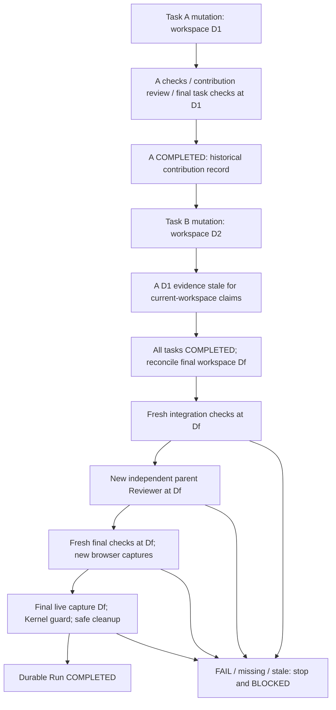
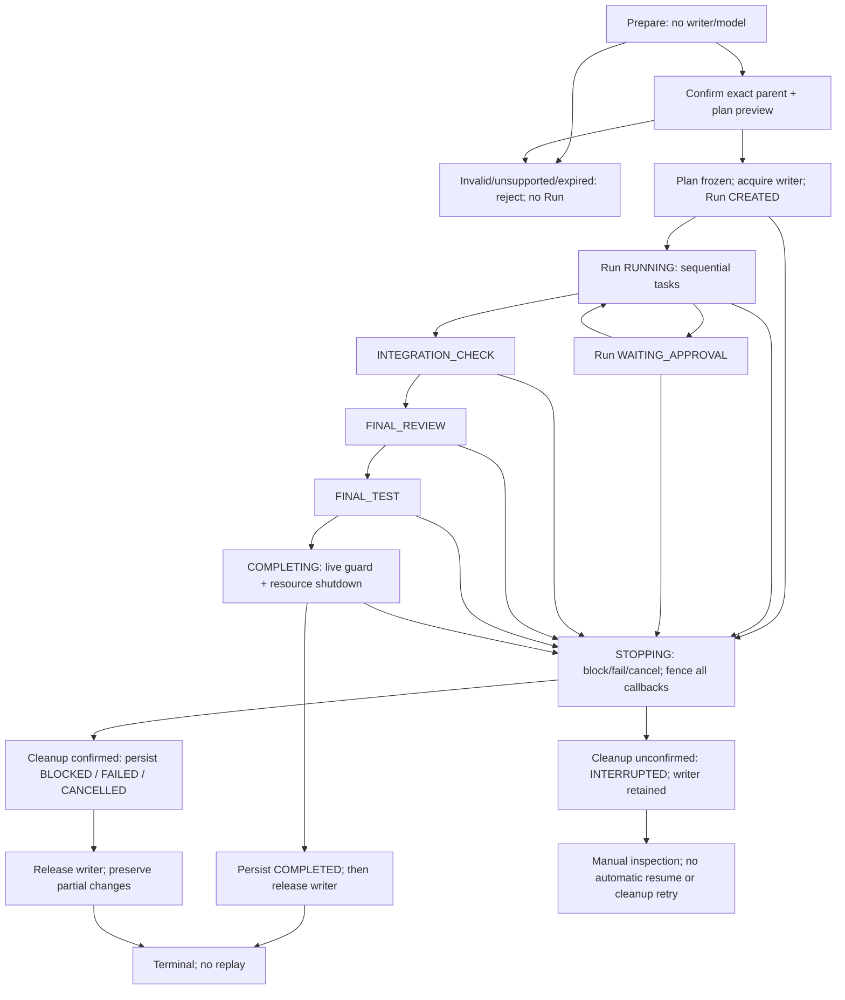

# COMPLEX sequential workflow — V0.7B architecture contract

## 1. Status, decision, and scope

**DESIGN ONLY; proposed contract freeze for review. No COMPLEX implementation or execution PASS is claimed.** This document resolves [#15](https://github.com/kjg8619/Weavra/issues/15), follows [#23](https://github.com/kjg8619/Weavra/issues/23), and is the implementation contract for [Runtime #16](https://github.com/kjg8619/Weavra/issues/16), [App #17](https://github.com/kjg8619/Weavra/issues/17), and the negative corpus for [integration #18](https://github.com/kjg8619/Weavra/issues/18). Implementation may start only after this design is reviewed and merged. V0.7B is a development stage, not a package semver.

- Audited consolidated baseline: `67dec9481f694a9724b33825adb65c4b095a6ee4`, repository `kjg8619/Weavra`, integration branch `devlop`.
- Dedicated design branch: `design/v0.7b-complex-contract`; worktree: `Weavra-worktrees/v0.7b-complex-contract`.
- At audit start, remote `devlop` matched that baseline, open PR count was zero, and #14 was CLOSED via merged PR #28. [Baseline CI](https://github.com/kjg8619/Weavra/actions/runs/35696596569) reported success. These are historical prerequisite results, not validation of this design's unimplemented behavior.
- Current consolidated source is authoritative. Older split Pi/T3 roadmap results are historical context only. This PR changes this document and the root Korean work log, not Runtime/App behavior.

> V0.7B COMPLEX is one frozen parent Task Contract decomposed into multiple bounded tasks, executed sequentially under one Runtime-owned Run, followed by mandatory integration verification and independent final review/checks.

At most one task is active and at most one mutable worker exists. The Runtime Run writer remains the overarching writer. Task ownership narrows responsibility under that writer; it never grants filesystem permission, Policy ALLOW, Approval, or completion authority.

**Chosen minimum:** a deterministic Host compiler of explicit bounded human planning data; no model-backed Planner, no executable Lead session, no new Host command, no mutable plan after confirmation. Exact-file exclusive claims; no subtree/glob/shared ownership. Review every task plus one final independent review. No integration repair loop. Strict consumer-first landing: **#15 → #17 App → #16 Runtime → #18 combined verification**. #16/#17 may develop concurrently in separate worktrees after #15 merge, not before.

## 2. Current behavior audit, not future claims

Paths and line ranges below refer to the exact baseline. The source index in §18 links each inspected boundary. Existing test bodies are evidence of intended current behavior; no Runtime/App test suite was run for this documentation-only PR.

| Current fact | Baseline evidence / consequence |
| --- | --- |
| `WorkflowSchema` already includes `COMPLEX`; `RoleSchema` includes `Lead` | `contracts.ts:29–31`. Presence in schema does not enable execution. |
| Classification can return COMPLEX | `classification.ts:28–73`; architecture/multiple-module heuristics select it. `selectWorkflow:94–95` advertises Lead/Developer/Reviewer. |
| Host planning rejects COMPLEX, including selected overrides | `host-workflow.ts:39–73`; draft type at 24–31 only admits QUICK/STANDARD. It does not downgrade COMPLEX. |
| Workflow and Kernel independently refuse COMPLEX | `workflow.ts:138–147`; `kernel.ts:599–620` blocks `start`. Removing only the Host rejection is insufficient. |
| STANDARD is `implement → self-check → review → test → complete` | `contracts.ts:15`, `kernel.ts:729–1277`; bounded Reviewer REVISE returns to implement. QUICK omits review. |
| Lead is not executable in the current Runtime | `ports.ts:44–74` admits only Developer/Executor/Reviewer requests/results; Kernel selects only those at `kernel.ts:775–782`. Lead in schema/history/team metadata is not a planner implementation. |
| Parent criteria are Host-created and frozen | `task-contract.ts:48–86`; AC-001…AC-016, registered check mapping, STANDARD review requirement. `criterion-evidence.ts:22–26` hashes `{id,goal,acceptanceCriteria}`; lifecycle status is deliberately excluded. |
| Runtime owns Policy, Risk, Approval, verification, writer, and completion | Policy/tool registration and dispatch stay Runtime-local; `workflow.ts` binds the execution contract, workspace, verifier and writer; `kernel.ts:287–426,1195–1252` alone checks and persists completion. App observation is not a state transition. |
| Current completion is parent/single-task shaped | `Run.tasks` holds the parent; `currentTask` identifies it; step identity is `(runId,stepId,attempt)`. Existing `revision` fields in worker/check evidence mean code cycle, not durable `Run.revision`. COMPLEX must add task identity rather than repeatedly pretending each task is the parent. |
| R2 and R3 currently require STANDARD | `kernel.ts:299–340`; R3 additionally requires exactly one consumed scoped tracked-text-file deletion, revision zero, and matching actual diff. COMPLEX support must explicitly extend guards, not bypass these checks. |
| Budget is Kernel/Workflow-owned and optional today | `budget.ts:49–122`, `kernel.ts:706–727`. Reserve before invocation; unavailable measurement sets reported tokens to null; a configured token cap denies subsequent work if usage is unknown. Counts are provider-reported, not billing or exact in-flight token caps. |
| Workspace evidence is broader than changed-file names | `workspace.ts:67–114,176–256`: clean start, baseline HEAD/index/config, full byte/mode images, ignored files inside allowed roots, bounded full-workspace digest. Current `diffDigest` is bare 64-hex, not `sha256:`-prefixed. |
| Existing workspace checks do not attribute every allowed-path mutation to a task | `workspace.ts` verifies safety/baseline but has no task claim or expected-mutation ledger. #16 needs pre-effect ownership enforcement and boundary reconciliation; comparing changed-file names alone is insufficient. |
| Cancellation has independent canonical/resource concerns | `kernel.ts:1279–1310` may record CANCELLED after an aborted step; `workflow.ts:341–379` separately awaits cleanup and retains the writer if resources are unconfirmed. A current CANCELLED label alone is not cleanup proof. §9 defines stronger COMPLEX settlement explicitly, without claiming it already exists. |
| Durable state and observations are distinct | `state-store.ts` owns lease and persistence; `provenance.ts` / `evidence.ts` produce bounded descriptive projections. Existing check records can contain bounded stdout/stderr; the new COMPLEX evidence projection must not copy those raw logs. |
| Host Control is strict, opt-in stdio v1 | `host-control-protocol.ts:14–104,153–260`: exact 11-command tuple, 32,768-byte request and 65,536-byte response including framing constraints. Preview is short-lived and one-use; confirmation is not R3 approval. |
| App projects parent preview/run/writer/cancel/approval today, not a task scheduler | App duplicated `weavraControl.ts`, server `RuntimeController.ts`, client `state/weavraControl.ts`, and `WeavraControls.tsx`. Preview currently allows QUICK/STANDARD, although ordinary run classification already admits COMPLEX. |

The [company-runtime README](../../runtime/pi/packages/company-runtime/README.md), [historical architecture](../../runtime/pi/docs/ARCHITECTURE.md), and [historical roadmap](../../runtime/pi/docs/WEAVRA_ROADMAP_2026-09-17.md) describe current single-sequence features and future COMPLEX ideas. They do not authorize a Lead model, parallel execution, or Git automation. The [V0.7A Broker contract](CAPABILITY_BROKER.md), especially §§3, 6–7, remains intact: discovery is descriptive, not permission; preserve the strict producer/consumer boundary and byte limits.

## 3. Authority and entry contract

### 3.1 Owners

| Decision | Sole existing authority / permitted extension |
| --- | --- |
| Parent goal, criteria, registered checks, allowed paths, mode and Risk | Runtime Host freezes user-confirmed input and trusted config/classification. Planner data cannot change them. |
| Decomposition proposal | Human-supplied bounded draft; deterministic Runtime Host compiler validates/assigns IDs. No execution authority. |
| Plan acceptance and task eligibility/transitions | CompanyKernel revalidates frozen bindings, states, budgets and evidence; Workflow drives one awaited call at a time. |
| Tool registration and exposure | Runtime runner/Host registration only; no App/Planner/Broker registrations. |
| Mutation permission | Existing Policy + Execution Contract + tool/path/precondition checks. Task claim is an additional denial gate. |
| Exact R3 grant | Existing human ApprovalPort / Host command binding; Kernel tracks durable one-use state. |
| Check result / browser verification | RegisteredVerifier with fresh captures and frozen registrations. Browser/Jev candidates remain CANDIDATE_ONLY. |
| Completion | Kernel only, after §8 predicates and safe cleanup; StateStore durably records before events. |
| Writer acquisition/release | Existing Workflow/FileStateStore lease and resource safety checks, not an App task label. |
| Display / reconnect | App consumes snapshots; cannot advance task, mutate graph, mint evidence or revive a Run. |

A future Planner could inspect bounded project context and propose decomposition, order, AC mapping, ownership, dependencies and integration risks as structured data. It could not rewrite the parent, grant tools, register checks, change Policy/Risk/mode, approve R3, assert trusted PASS/COMPLETE, invoke Git mutation, or override Kernel. **V0.7B does not instantiate that future role.** A deterministic compiler is sufficient when the decomposition is explicit; heuristic free-text decomposition would invent ownership/verification obligations. The cost is an explicit pre-confirmation planning form, not an autonomous planning loop.

### 3.2 Prepare and confirmation

1. Existing `workflow.prepare` accepts optional `complexDraft` (§4). It still requires canonical owner/project/request identity, goal and optional acceptance statements. Unknown fields are rejected.
2. Runtime classifies the goal and selects workflow using trusted config. COMPLEX requires a valid draft; no silent downgrade. A draft on QUICK/STANDARD is rejected with existing `INVALID_REQUEST`. Unrecognized/conflicting mode or unsupported Risk/action remains `UNSUPPORTED_WORKFLOW`/`INVALID_GOAL` as applicable. A recognized COMPLEX without a draft returns `UNSUPPORTED_WORKFLOW`; App can explain the missing structured plan locally.
3. Host builds the pending parent once, with the existing AC IDs and registered required checks. For COMPLEX, every parent AC has `reviewRequired=true` (extend the STANDARD construction/binding rule). It validates draft references without changing parent goal/criteria, mode, Risk, check registration or allowed paths. Invalid graph/coverage/ownership/check references return `INVALID_CRITERIA`; invalid shape returns `INVALID_REQUEST`. No new error enum is needed.
4. Compile a new immutable plan, bind it to the parent and preview (§4). Preparation is side-effect-free with respect to execution: no model, check, writer, Approval, or durable Run. Bounded project/path/config reads are allowed under existing Host preflight trust. No model tokens are spent.
5. Existing preview shows the complete parent and complete ordered plan. `workflow.confirm(previewId,previewDigest)` authorizes that exact preview once. Runtime retains the current 300,000ms TTL and owner/project/config/source freshness fences. A changed/expired preview must be prepared and confirmed again; never patch a confirmed plan.
6. Confirmation rechecks canonical sources, claims, clean workspace, required check registration and response bounds, consumes the preview, acquires the one writer, captures baseline, and creates one Run. Start failure reports existing `START_FAILED`, preserving any partial state and cleanup status. No automatic retry.
7. Before execution: 2–8 tasks; complete AC coverage; at least one required registered parent check; every task has at least one selected registered local check; all claims feasible; finite budgets; required trust/sandbox resources available. READ_ONLY claims must be empty. R3 uses only §7's narrow supported case. Unsupported work fails closed rather than creating a reduced contract.

**Minimal input extension justification:** existing `workflow.prepare` has only goal/criteria/recipe inputs and cannot express dependencies or exact owned files. `complexDraft` is necessary to avoid invented decomposition or a new model. It is proposal data on the existing preparation command, not an execution RPC. No new command, task-control button, plan-edit-after-confirm command, or generic mutation endpoint is added. Existing recipes remain STANDARD-only; `recipeId`/`recipeInputs` plus `complexDraft` is rejected in V0.7B.

## 4. Frozen schema and identity

These are normative TypeScript-style wire/data shapes, not production code. Every object is closed (`additionalProperties:false` / Effect strict excess-property rejection); `?` means absent, never null unless explicitly allowed. Bounds and semantic rules below are part of the schema. Runtime and App duplicate the wire shapes; neither imports the other's source.

```ts
type Digest = string;          // ^sha256:[0-9a-f]{64}$
type WorkspaceDigest = string; // ^[0-9a-f]{64}$; existing GitWorkspace encoding
type Id = string;              // existing Host identifier: 1..128 [A-Za-z0-9._:-]+
type TaskId = string;          // ^CT-00[1-8]$, contiguous plan order
type CriterionId = string;     // existing ^AC-[0-9]{3}$; must be in parent

type OwnershipClaim = {
  path: string;                // exact normalized project-relative file, §5
  operation: "modify" | "create" | "delete";
};
type ComplexDraft = {
  tasks: Array<{
    title: string;
    goal: string;              // bounded contribution to parent, never new parent AC
    dependsOnIndexes: number[];// 1-based references to earlier draft rows only
    criterionIndexes: number[];// 1-based references to normalized parent criteria
    ownership: OwnershipClaim[];
    checkIds: Id[];            // local registered-check selection only
  }>;
};
type ComplexTask = {
  id: TaskId;
  title: string;
  goal: string;
  dependsOn: TaskId[];
  criterionIds: CriterionId[];
  ownership: OwnershipClaim[];
  checkIds: Id[];
  maxRevisionCycles: number;
};
type ComplexPlan = {
  schemaVersion: 1;
  planId: Id;                  // Runtime-issued canonical lowercase UUID
  complexPlanDigest: Digest;
  parentTaskId: Id;
  parentTaskContractDigest: Digest;
  tasks: ComplexTask[];        // order is execution order, not a scheduling hint
  integration: {
    criterionIds: CriterionId[];
    checkIds: Id[];
    reviewRequired: true;
    finalChecksRequired: true;
  };
  limits: {
    maxTasks: 8;
    maxWorkerInvocations: number;
    maxReportedTokens: number;
    maxTotalRevisionCycles: number;
  };
};
```

### 4.1 Bounds, ordering and validation

- Draft/plan tasks: 2–8. Title: nonblank 1–80 characters; goal: nonblank 1–300. Human text is untrusted advisory content, not executable instructions or new acceptance criteria.
- Task criterion IDs/indexes: 1–16 unique, in parent order. Union across tasks must equal the entire parent AC set. Many tasks may contribute to one AC; no task may refer to an unknown AC. All tasks are required; no optional/drop/skipped-success tasks.
- Dependencies: 0–7 unique earlier IDs/indexes in plan order; reject self, forward edge, duplicate, missing identity and cycle. Host does not silently topologically reorder. Empty dependency arrays are valid, but global sequential order still applies.
- Ownership: 0–16 claims per task, at most 64 across the plan, ASCII path-sorted. Duplicate paths even with different operations are invalid. Claims are globally exclusive for the plan's lifetime.
- Local `checkIds`: 1–16 unique registered IDs, ASCII-sorted, all selected from the union of the mapped parent AC check IDs. Each is mandatory for that task even if a registration otherwise permits optional execution. No worker-created command/argv/check. Parent integration includes **all registered checks**, with their frozen required/optional semantics, and all parent AC mappings; maximum 16 registrations for COMPLEX. Configurations over that bound fail preflight; nothing is truncated or deregistered.
- `integration.criterionIds` exactly equals the parent's ordered AC list; `integration.checkIds` exactly equals the complete frozen registration ID list sorted ASCII. At least one is required. Existing optional-check FAIL semantics are retained, not silently ignored.
- Integers are safe integers. Counts, attempt/revision caps and budgets are in §6. Strings, arrays and scalar maxima are checked before allocation/expansion. Plan JSON is at most 12,288 UTF-8 bytes; draft JSON at most 12,288. Counts do not override bytes.
- Host assigns `CT-001`… in accepted order; model/user cannot supply `id`, `status`, digests, limits, Risk or permissions. Parent ID and plan UUID are Runtime-issued. App may display but never issue authoritative IDs.

### 4.2 Digest material and immutability

Reuse `taskContractDigest` exactly: SHA-256 of existing ordered `JSON.stringify({id,goal,acceptanceCriteria})`, with `sha256:` prefix. Parent lifecycle `status` may change as a projection; parent identity, goal, AC IDs/statements/scopes/verification mapping cannot.

`complexPlanDigest = sha256(canonicalJSON(["weavra-complex-plan-v1", planWithoutComplexPlanDigest]))`, prefixed `sha256:`. Canonical JSON follows the existing Broker canonical-object convention: recursively sort object keys by code-unit order, preserve arrays, UTF-8, no whitespace. No undefined/nonfinite values. Only the digest field is excluded; parent identity/digest, planId, all task goals/order/edges/claims/check mappings/revision caps and limits are included. Use a Runtime-local helper and an equivalent App implementation/fixture; do not introduce a shared package.

The existing opaque preview digest must include the complete `complexPlan`, parent digest, and existing frozen Host/config/workspace confirmation material. The plan digest is not a signature and does not authorize anything. Runtime recomputes it at admission, before each task, before integration and completion. Current Policy/config/registered-trust/execution bindings remain separately checked; they are not replaced by a plan hash.

No `planRevision` counter exists. Re-preparing before confirmation produces a fresh plan UUID/preview, invalidates the previous preview, and requires a new confirmation. After confirmation no task ID, graph, title/goal, AC mapping, ownership, check selection or budget can change. A change requires an explicit new Run after manual inspection, with the existing clean-start requirement; no auto-resume/rollback.

## 5. Task/file ownership and workspace contract

### 5.1 Exact paths, never permission

`ownership` means responsibility for mutation of an exact file in this plan, not filesystem access or Policy ALLOW. It is checked in addition to the frozen Run execution mode, Risk, role, active task identity, registered tool, allowed paths, protected paths, receipts, Approval and current path inspection.

- Only exact files are supported. Directory/subtree claims, root `.` claims, arbitrary glob patterns, exclusions, implicit children, shared ownership and automatic longest-prefix rules are rejected. An allowed Policy subtree can contain several explicitly claimed files; that does not make the subtree owned.
- Canonical form: relative POSIX path, slash-separated nonempty components, no leading/trailing slash, backslash, `.`/`..`, NUL/control/bidi characters, wildcard metacharacters or absolute/drive path. UTF-8 path length ≤256 bytes. Reject noncanonical spelling rather than silently trimming/rewriting it. Preserve filename case and Unicode bytes; do not Unicode-normalize filesystem names.
- Resolve against the existing canonical project root with `FilePolicyPathInspector`; reject symlink ancestors/targets, special files, multiple hard links, unsupported filesystem identity and root escape. Resolve existing names to their actual filesystem spelling; reject case/normalization aliases rather than allowing two spellings of the same file. For missing create targets, validate the existing parent identity and collision behavior, and use no-clobber creation. Reinspect immediately before effect; the lexical string alone is not sufficient.
- `modify` requires an existing supported regular text file at admission; allows only existing-file edit/replace, never create/delete. `create` requires a missing leaf with existing safe parent; allows one no-clobber create then edit/replace by the same task/attempt lineage, never recreation after deletion. `delete` requires §7's supported tracked-text-file R3 target; allows only exact deletion after Approval. No new directory creation operation is added.
- Rename/move is unsupported. Do not emulate rename with a hidden delete/create or use Git rename APIs. An explicitly separate delete/create plan is also outside the narrow R3 case in §7.
- All existing protected paths remain protected, including `.git`, Runtime state/config, credentials, selected project instructions and trusted verifier sources. Ownership cannot make protected oracle/dependency files editable. Dependency manifests and lockfiles retain existing Policy/Risk treatment; R2 is not reduced by a claim. If Policy denies a required dependency file, preparation/execution blocks instead of granting ownership-based access.
- If several tasks need to modify one file, the human must consolidate its modifications into a single owning task before confirmation and make other tasks read-only consumers/dependents. A dependency edge never conveys write ownership. If this cannot express the requested work safely, reject the plan; do not auto-split by line, hand off ownership, or silently merge tasks.

### 5.2 Reservation, acquisition, and enforcement

All claims are validated/reserved atomically with plan admission under the Run writer. A task's execution lease becomes active only at Kernel `ELIGIBLE → IMPLEMENTING`, after successful predecessors and workspace reconciliation. Only that task's Developer can use its claims. Read-only tasks have no mutable lease. Reviewer, checks, Planner data, App and later tasks never acquire it.

Runtime tool dispatch order is: current task/attempt and cancellation fence → exact ownership/operation check → existing Policy/durable intent/Approval as needed → path/receipt/precondition reinspection plus active ownership fence → effect → durable action outcome and expected image update. Both early and final ownership gates are necessary; neither is Policy ALLOW. The adapter receives trusted task context from Kernel, never from worker tool arguments. Late callbacks from previous attempts/tasks are rejected. Worker tool calls remain sequential.

```text
Task A owns src/a.ts; active Task B requests edit(src/a.ts)
  → OWNERSHIP_CONFLICT
  → no effect / no Approval request / no retry or reassignment
  → stop resources → Task B BLOCKED → Run BLOCKED → release writer if safe
```

An unclaimed file is `UNOWNED_PATH`, with the same block/no-effect behavior. Known pre-effect denials must leave bytes unchanged. Partial I/O after an otherwise permitted action is not falsely described as zero mutation: fail the task, retain observed partial changes, stop and reconcile, never rollback.

The active lease ends after task checks/review and safe task settlement, or safe failure/cancel cleanup. Its claim remains reserved in the immutable plan after COMPLETED/BLOCKED/FAILED/CANCELLED and is never transferred to another task. On unconfirmed cleanup keep the lease/writer quarantined. Only safe Run termination releases the Run writer; no next task runs during cleanup.

### 5.3 Baseline and external mutations

One already-selected checkout and one clean baseline for the whole Run. Record baseline HEAD and initial full workspace digest once. Keep existing HEAD/index/config/source identity checks. Task start/end images are additional snapshots against that same baseline, not new Git baselines. Final diff is the complete Run diff, including earlier tasks. Cancellation/failure reports that cumulative diff plus task-local changes and unknowns.

#16 must add a trusted expected-image/mutation ledger: each successful Runtime mutation records its exact task/attempt/path, pre/post image digest and mode; task start, every tool effect, task end, before/after each verifier/reviewer and completion compare captured images against the expected cumulative state. Detect content changes even when the file was already changed earlier. Unexplained change, missing attribution, mode change, unowned modification, HEAD/index/config change or capture uncertainty invalidates evidence and blocks; paths merely existing never satisfy a dependency.

Checks and Reviewers may not mutate accounted project files, including another task's files. Existing ignored output outside the capture boundary is not claimed to be task evidence. Trusted check side effects inside the boundary fail closed. Existing strict trust/sandbox protections remain; ownership is not an OS sandbox. Known external changes are rejected, but concurrent noncooperating writes between filesystem syscalls and exact-byte ABA changes are not universally preventable/detectable by the existing adapters. Do not claim otherwise or weaken receipt/source-generation protections. New boundary tests must exercise detectable external mutation, not assert magical filesystem isolation.

No automatic commit, merge, rebase, reset, checkout rollback, stash, branch creation, worktree creation or conflict resolution occurs in a COMPLEX Run. Existing explicit launcher worktree commands are separate user operations; this design does not call them. This PR's dedicated development worktree is not a Runtime feature.

## 6. Revisions, budgets, and accounting

| Name | Frozen meaning |
| --- | --- |
| `Run.revision` / wire `stateRevision` | Monotonically increasing durable snapshot revision on every successful persistence; compare-and-observe/cancel fencing. Not an execution attempt. |
| `Run.revisionCycle` | Total code/work revision cycles consumed across COMPLEX tasks; starts 0, increments only on accepted local Reviewer REVISE. Maximum 3, further limited by configured `agents.max_revision_cycles`. Moving to a new task does not increment it. |
| Task `revisionCycle` / `attempt` | Local revisions consumed 0–2; `attempt = revisionCycle + 1` after first activation, otherwise 0. Attempt is per task, never a durable revision. Fresh Developer/Reviewer sessions and evidence each attempt. |
| Evidence `revision` | Keep the existing work-cycle meaning: snapshot of global `Run.revisionCycle` at invocation. Add task/attempt/stage binding; never use durable revision as worker evidence revision. |
| COMPLEX plan revision | None. New pre-execution prepare creates a new plan identity, not an in-place revision. |

Fixed maxima/defaults for COMPLEX: 8 tasks, 24 worker invocations, 200,000 provider-reported tokens, 2 local revision cycles, 3 total revision cycles. Effective global worker/token limits are the minimum of these maxima and explicitly configured existing Budget limits; if configuration omits limits, use these COMPLEX defaults. Effective total revision limit is `min(3, agents.max_revision_cycles)`; each task receives `min(2, effectiveTotal)` in its frozen plan. R3 forces both revision limits to 0. No new budget configuration namespace is needed. Limits cannot be raised mid-Run. At most `(8 + 3) × 2 + 1 = 23` Developer/Reviewer invocations can complete under the chosen state machine, within the 24 hard ceiling; each attempt may end early.

Reuse one Kernel-owned `BudgetController` across all tasks and final review. Reserve before every Developer/Reviewer call, including failed/cancelled calls; exactly-once settlement records trusted adapter measurements. Per-task invocation/token subtotals are descriptive partitions of this same ledger, not independently reset budgets. Verification processes do not count as workers; their execution is bounded by at most two selected-check batches per task attempt plus two integration batches (≤24 batches, ≤16 checks each), and existing per-check timeout/process/output caps. No Planner calls or Planner retries exist. There is no new wall-clock Run deadline: the current code has per-process/check/session bounds, not a trustworthy persisted whole-Run deadline seam.

Unknown usage is null, never zero. A failed/aborted/unmeasured invocation retains its reserved count and unavailable provenance. With the mandatory COMPLEX token cap, unknown usage or reaching/exceeding the cap blocks before any next worker **and before completion**, even if the last required Reviewer just returned PASS. This final-settlement check is an explicit COMPLEX strengthening of the current pre-invocation Budget seam. In-flight token overage is recorded honestly; this is not a billing hard cap or a promise to stop at exactly 200,000 tokens. Invocation exhaustion denies the next reservation; exactly consuming the last permitted invocation is not itself a failure if all work/evidence is complete.

Budget denial and revision-limit exhaustion → BLOCKED after safe cleanup. Preserve partial changes; no new Approval, rollback, plan rewrite, silent skipped task or fabricated completion. `verification.repair.mode=self-check-once` remains a STANDARD-only feature; COMPLEX does not stack that extra repair allowance on Reviewer revisions. A local SELF_CHECK/TEST failure blocks; it never enters the old repair branch.

## 7. Exact task machine, dependencies, review and Approval

### 7.1 Task states

```ts
type ComplexTaskStatus =
  | "PENDING" | "ELIGIBLE" | "IMPLEMENTING" | "WAITING_APPROVAL"
  | "SELF_CHECK" | "REVIEW" | "TEST" | "STOPPING"
  | "COMPLETED" | "BLOCKED" | "FAILED" | "CANCELLED" | "INTERRUPTED";
```



```mermaid
stateDiagram-v2
  [*] --> PENDING
  PENDING --> ELIGIBLE: next ordered task and every predecessor COMPLETED
  ELIGIBLE --> IMPLEMENTING: Kernel reserves attempt / acquires task lease
  IMPLEMENTING --> WAITING_APPROVAL: exact R3 request
  WAITING_APPROVAL --> IMPLEMENTING: exact fresh approval; action consumed once
  IMPLEMENTING --> SELF_CHECK: valid handoff and reconciled images
  SELF_CHECK --> REVIEW: local selected checks PASS and fresh
  REVIEW --> TEST: independent contribution review PASS
  REVIEW --> IMPLEMENTING: REVISE; both revision budgets available; fresh attempt
  TEST --> COMPLETED: fresh checks, same reviewed digest, safe task cleanup
  PENDING --> BLOCKED: Run blocked/failed or predecessor not successful
  ELIGIBLE --> STOPPING: cancellation / gate failure
  IMPLEMENTING --> STOPPING: cancel / failure / ownership denial
  WAITING_APPROVAL --> STOPPING: reject / expire / cancel / binding failure
  SELF_CHECK --> STOPPING: cancel / check failure / stale evidence
  REVIEW --> STOPPING: cancel / BLOCK / limit / missing review
  TEST --> STOPPING: cancel / check failure / stale evidence
  STOPPING --> BLOCKED: safe cleanup; safety or verification denial
  STOPPING --> FAILED: safe cleanup; execution fault
  STOPPING --> CANCELLED: safe cleanup; user cancel
  STOPPING --> INTERRUPTED: cleanup unknown or owner lost
  PENDING --> CANCELLED: Run cancelled before activation
  PENDING --> INTERRUPTED: owner lost
  COMPLETED --> [*]
  BLOCKED --> [*]
  FAILED --> [*]
  CANCELLED --> [*]
  INTERRUPTED --> [*]
```

Only Kernel writes these states. `PENDING` has attempt 0/no evidence/no lease. `ELIGIBLE` is a persisted scheduling decision, not permission and not another worker. The scheduler considers **only the next array entry**, never searches for another runnable task. It must see all declared dependencies and all earlier ordered tasks COMPLETED. A missing/non-success predecessor → block, even if its output files exist. No task may self-declare successful dependency completion.

`IMPLEMENTING` has one Developer, not Executor/Lead. The task's bounded contribution input accompanies the **unchanged parent**; do not construct a replacement Task Contract. Developer handoff is an untrusted claim until Kernel validates identity, actual changed-file reconciliation and unresolved work. `SELF_CHECK` and `TEST` execute the frozen selected registered checks through RegisteredVerifier. `REVIEW` always uses a new read-only Reviewer session; model/provider may match Developer, session ID **and** session file must differ from every Developer session in the Run. Final Reviewer must also be a new session distinct from all previous sessions. Planner/Lead cannot substitute.

A task review judges the declared contribution for each mapped AC, not whether the whole parent is MET. Its closed criterion result is `SUPPORTED | UNSUPPORTED | UNVERIFIED`; PASS requires exact mapped-ID coverage, all SUPPORTED, no blocker, and valid current evidence refs. This is separate from the existing final parent `MET | UNMET | UNVERIFIED` review. Task `COMPLETED` means its contribution passed at that attempt's workspace, not enduring parent completion.

REVISE is the only local code-loop edge: settle Reviewer/measurements, persist failure history, consume local+global revision budget, clear current handoff/check/review evidence, retain claim, and allocate a fresh attempt/session. No revision after task COMPLETED, no reassignment, no revisiting earlier tasks. SELF_CHECK FAIL, TEST FAIL, Reviewer BLOCK, unsupported/malformed evidence and exhausted limits block. Worker/provider/tool/I/O faults fail; known Policy/ownership/Approval/budget/freshness denials block. A malformed worker result is FAILED; schema-valid forged evidence is BLOCKED. No downstream task runs in either case.

Terminal predecessor behavior: COMPLETED permits eligibility only through canonical state and expected-workspace chain; BLOCKED/FAILED/CANCELLED/INTERRUPTED prohibits it. A partially changed task without COMPLETED is never satisfied. When the Run stops, retain earlier COMPLETED rows; mark remaining PENDING/ELIGIBLE rows BLOCKED (`RUN_STOPPED` or `DEPENDENCY_NOT_COMPLETED`), CANCELLED for user cancel, or INTERRUPTED for owner loss. If one task is STOPPING, no other task becomes active. COMPLETED rows are never rewritten as failures merely because later evidence becomes stale.

### 7.2 R2 / R3

R2 retains the bound Run Policy context, required registered checks, exact workspace reconciliation and independent Reviewer. The existing STANDARD-only checks must gain an explicit guarded COMPLEX branch; never loosen all workflows or relabel COMPLEX as STANDARD. Every task inherits parent Risk, not a Planner-assigned lower risk. READ_ONLY tasks may use fewer tools under the parent mode, but cannot create a different execution contract.

V0.7B R3 stays **one exact tracked-text-file deletion per Run**, not generic destructive execution: exactly one `delete` claim, no create/modify claims anywhere, all other tasks read-only contributions, no revisions. The target is the Runtime-selected existing narrow `selectR3Scope(parent.goal, runId)` target and must pass current Policy/path/size/tracked checks. Unsupported natural-language/generic R3 requests are rejected; draft ownership does not choose or broaden an R3 target. The deletion task must be first so every subsequent task's checks satisfy the existing consumed-deletion prerequisite. It is followed by at least one bounded read-only task, then integration. This preserves current R3 scope rather than adding multi-delete approval in a workflow feature.

```mermaid
stateDiagram-v2
  IMPLEMENTING --> WAITING_APPROVAL: Runtime-issued exact delete action; persist PENDING
  WAITING_APPROVAL --> IMPLEMENTING: approved + fresh bindings + one-use consume
  WAITING_APPROVAL --> STOPPING: human reject / EXPIRED / cancel
  IMPLEMENTING --> STOPPING: approval stale before effect / consume persistence fault
  STOPPING --> BLOCKED: denied/expired; safe cleanup; no action
  STOPPING --> CANCELLED: cancel; safe cleanup
  STOPPING --> INTERRUPTED: cleanup or persistence uncertain; keep writer
```



Approval remains action-specific human authority: current run/task/attempt/stage, actionId/actionDigest/configDigest, exact path/operation/precondition bytes, deadline and one-use consumption. Include the new Complex evidence context (§10) in Runtime action digest/request binding; never accept task IDs from the model or App to rebind it. Host's existing opaque `approvalId` binds the exact pending request; App sends only the existing resolve fields. No plan/parent blanket Approval, no approval transfer to later task/revision, no automatic request retry.

PENDING preserves Run WAITING_APPROVAL; no downstream work. APPROVED is not success until the same action is safely consumed and audited. DENIED/EXPIRED → task/Run BLOCKED after cleanup, no mutation. If freshness fails after approve but before effect, no mutation and BLOCKED; if audit/persistence fails after the effect, FAILED or INTERRUPTED with partial/unknown changes, never replay. Cancel while waiting aborts the wait, invalidates unconsumed authority, cleans resources and then records CANCELLED. A late approval reply cannot reactivate the task. Consumed deletion remains in the workspace after later failure/cancel; never recreate the file automatically.

## 8. Verification layers and completion predicates

### 8.1 Three layers

| Layer | Trusted input and purpose | What it cannot prove |
| --- | --- | --- |
| Task verification | Current task handoff, task start/end image delta, selected registered checks twice around independent contribution review; exact parent/plan/task/attempt binding | Whole-parent AC satisfaction or final integration |
| Integration verification | All tasks COMPLETED; current combined workspace; all registered checks and parent AC mappings; fresh first integration batch; final independent parent review; fresh final check batch | Completion without Kernel guards, current workspace/Approval/budget and safe cleanup |
| Run completion verification | Kernel independently verifies all immutable identities, canonical states, evidence/captures, final workspace, budgets, risk/approval and safe resources; durably persists COMPLETED | It cannot infer success from App, Planner prose, Evidence Pack or mere task counts |

Task evidence retained: entry/exit full-workspace digests; exact local changed-file list and delta digest; handoff identity; selected checks/statuses/refs; contribution review/verdict/session identity; attempt/global work cycle; parent and plan digest; worker measurement provenance; approvals/action outcomes and failure code. Failed/revised attempts remain evidence history, not reusable success.

A task evidence envelope binds `(runId, parentTaskContractDigest, complexPlanDigest, taskId, attempt, revision, stage, workspaceDigest)`. Runtime, not the worker, chooses that context. Every check/ref/session must match the envelope and the underlying trusted registry. Repeating a check ID in another task does not make old evidence valid there.

### 8.2 Freshness and the mandatory final gate



Conservative whole-workspace freshness: any accounted image/HEAD/index/config/source generation change invalidates earlier evidence **for current completion**, even if it touched a different task's file. Earlier task COMPLETED remains historical and can satisfy scheduling only because its end image was reconciled and subsequent mutations follow the authorized ledger. Never copy that old PASS into the final integration set. No incremental relevance inference or cached-check optimization in V0.7B.

Integration order is fixed: `INTEGRATION_CHECK → FINAL_REVIEW → FINAL_TEST → COMPLETING`. The first and last check batches each execute the complete frozen registration list and validate parent mappings. Integration is over the complete combined Run diff and all parent criteria, not the last task's delta. Runtime assembles a bounded aggregate handoff from validated task handoffs; no model creates a new goal/criterion/check. Final Reviewer gets all parent ACs, final diff, fresh integration evidence and bounded contribution/risk summaries, and must return existing exact AC-ID coverage with every criterion MET and PASS. Cross-task interaction failures are represented through those registered checks and that final review, not invented hidden criteria.

Fresh equality required at task success: `handoffExitDigest = selfCheck.diffDigest = taskReview.diffDigest = taskTest.diffDigest = liveTaskExitDigest`. Fresh equality at Run completion: `integrationCheck.diffDigest = finalReview.diffDigest = finalTest.diffDigest = liveCompletionDigest = expectedLedgerDigest`. All results must share parent/plan/run binding, correct stage and current integration context, frozen check/trust/sandbox requirements and actual passing required results. Require distinct fresh browser captures for first/final batches, current capture-time validity, and no candidate evidence reuse. Runtime revalidates trust/source identities before/after checks as today.

Local and final Reviewer independence is mandatory for all COMPLEX risk levels; especially no weakening of R2/R3. This bounded combination costs at most one Reviewer per task attempt plus one final Reviewer, with no model Planner, no selective-risk heuristics and no final review retry loop. REVIEW REVISE can revise only its current task within limits. Final REVISE/BLOCK → BLOCKED/new explicit Run, not ownership transfer or an integration mutation task.

`all tasks COMPLETED` alone is insufficient. Kernel must reject completion unless every required task has validated local-success history, the final integration set is fresh and complete, every parent AC is MET with registered evidence, no unresolved Approval/unsafe mutation remains, budget accounting is known/within limits, expected workspace matches, all resources are safely stopped, and the completion write succeeds. Missing/malformed/stale evidence never becomes an empty successful set. A failed terminal persistence write emits no RunCompleted; show local failure separately from the older durable snapshot.

## 9. Run machine, cancellation and partial failure

```ts
type ComplexPhase =
  | "TASK_SEQUENCE" | "INTEGRATION_CHECK" | "FINAL_REVIEW"
  | "FINAL_TEST" | "COMPLETING" | "STOPPING" | "TERMINAL";
type CleanupStatus = "NOT_REQUESTED" | "PENDING" | "CONFIRMED" | "UNCONFIRMED";
```



The outer Run statuses remain CREATED/RUNNING/WAITING_APPROVAL/BLOCKED/FAILED/CANCELLED/INTERRUPTED/COMPLETED. `Run.phase` continues to use existing PREFLIGHT/IMPLEMENT/SELF_CHECK/REVIEW/TEST/COMPLETE, with §10's Complex phase disambiguating integration. Task success does not set outer COMPLETED or parent completed. During task sequence map task IMPLEMENTING/SELF_CHECK/REVIEW/TEST to matching Run phase; approval maps IMPLEMENT plus WAITING_APPROVAL. Integration maps first checks→SELF_CHECK, final review→REVIEW, final checks→TEST, completion→COMPLETE. STOPPING retains the interrupted Run phase. New task-aware identity, not a reused parent `currentTask`, tells the consumer where work occurs.

**Cancellation ordering:** accept canonical cancel → set cancelling/STOPPING and close scheduling/effect callbacks → abort the active worker/check/reviewer/Approval wait → await confirmed termination/disposal of worker, verifier, browser/process, LSP and workspace subprocess resources → capture partial state only when safe → persist canonical CANCELLED → release writer. No next task or completion may interleave. Cancellation before a Run exists only invalidates the abandoned preview/local preparation; it does not forge a CANCELLED Run. No active Planner exists to kill; compiler work honors the Host cancellation/lifecycle signal, discards its result and acquires no writer.

A cancel request is not immediate canonical CANCELLED. Until cleanup settles, Run remains its active status with Complex STOPPING, cleanup PENDING and Host `cancelling=true`. Approved-but-unconsumed authority is invalidated before any further effect. Known cleanup uncertainty yields INTERRUPTED + cleanup UNCONFIRMED (if persistence works), not clean CANCELLED, and retains writer for manual inspection. Storage failure may leave durable state active; expose existing state-unavailable/start-failure/local diagnostic boundary rather than inventing a durable terminal result. No writer release on unconfirmed terminal persistence or unsafe resources. A later observation cannot complete/resume the Run.

If writer release itself fails after a successfully persisted safe terminal state, keep that canonical outcome and show writerPresent/cleanup diagnostics; do not rewrite it or start another Run. In particular a release failure cannot retroactively manufacture or erase verification. Resource cleanup is CONFIRMED before a successful terminal write; writer release follows it and is separately observable.

| Failure point | Required result after safe cleanup |
| --- | --- |
| Developer/provider/tool unexpected fault, invalid output, I/O failure | Current task FAILED; Run FAILED; remaining tasks BLOCKED; partial changes preserved |
| SELF_CHECK or task TEST FAIL / unavailable required check | Task BLOCKED; Run BLOCKED; no local check-repair loop |
| Task Reviewer BLOCK / missing independent review / invalid evidence | BLOCKED; no successor |
| Task Reviewer REVISE with allowance | Fresh same-task attempt only; else BLOCKED/REVISION_LIMIT |
| Ownership conflict/unowned mutation request | BLOCKED before effect; no reassignment |
| Budget/unknown token accounting | BLOCKED; no next worker or completion |
| R3 reject/expiry/unresolvable binding | BLOCKED; no action and no next task |
| Integration check FAIL, final review non-PASS, final TEST failure/stale | Run BLOCKED; previously COMPLETED tasks remain historical; parent not complete |
| User cancel during any active task/check/review/wait/integration | STOPPING then CANCELLED only with confirmed cleanup; no automatic resume |
| Crash/owner loss/unconfirmed cleanup | INTERRUPTED/unknown durable outcome; writer retained until existing manual/recovery safety rules permit release; never auto-resume |

All non-success outcomes keep partial edits/deletions, including changes from earlier completed tasks. `partialChanges=true` if known changes exist or the change set is unknown. Do not convert unknown to clean or advertise rollback. No terminal state has a re-entry edge. Explicit new preparation is required and may itself reject a dirty checkout.

## 10. Runtime state and exact App wire projection

### 10.1 Task-aware execution identity

```ts
type ComplexEvidenceContext = {
  parentTaskContractDigest: Digest;
  complexPlanDigest: Digest;
  scope: "TASK" | "INTEGRATION";
  taskId: TaskId | null;
  attempt: number;
};
```

Add optional `complexContext` with exactly this shape to Runtime-local step requests/results, action audit identity, Approval request/proposal, check/verification/handoff/review records, role-session and measurement attribution, and task/integration execution events. It is mandatory for those live COMPLEX execution records and forbidden on live QUICK/STANDARD records; historical absence is not COMPLEX evidence. Existing `runId`, `revision`, `step`, `diffDigest` fields remain; no duplicate independent authority field. TASK requires a current plan task and attempt 1–3; INTEGRATION requires taskId null and attempt 1. The `step.stepId` remains implement/self-check/review/test/complete, with the existing phase mapping. For COMPLEX only, `step.attempt` equals context attempt, not global `revisionCycle + 1`. `revision` still equals the captured global work cycle. The full identity is context + runId + revision + step; identical task attempt numbers in different tasks cannot collide.

The context is assigned by Kernel and passed as trusted adapter data, included in action digests and verifier evidence-ref namespaces, then checked again on submission and durable save. No worker-supplied free-form identity wins over it. Preserve existing STANDARD/QUICK schemas and semantics through a discriminated COMPLEX record branch, not by globally relaxing attempt guards.

Run-level lifecycle events (`RunCreated`, `RunStarted`, `RunCompleted`, `RunFailed`, `RunBlocked`, `RunCancelled`, `RunInterrupted`) do **not** carry `complexContext`. They retain existing run identity, parent `taskId`, sequence/stateRevision and add mandatory-on-COMPLEX `complexBinding: {parentTaskContractDigest: Digest, complexPlanDigest: Digest}`. This binds the frozen plan without inventing a task attempt before first activation or on recovery. Task/step/agent/check/review/Approval execution events carry `complexContext` instead, not both fields. Existing event `taskId` remains the parent ID; only `complexContext.taskId` identifies a subtask. Preparation emits no execution event. Both new fields are absent for QUICK/STANDARD. Events remain observations after persistence, never scheduler commands.

Runtime-local `ComplexTaskReview` uses existing review identity/verdict/issues/diff/evidence-ref fields and `complexContext`, but its `criteria[].status` is the contribution enum in §7. Final INTEGRATION review uses the existing parent `Review` criterion semantics plus context. Local Developer handoff retains parent `task` identity plus context, and actual task-local `changed_files`; final aggregate handoff retains parent identity, INTEGRATION context and cumulative changed_files. Kernel constructs that aggregate only from validated task records and current workspace; raw task prose cannot create evidence refs or parent MET. Verifier selects the frozen task `checkIds` only in TASK context and the full registration list in INTEGRATION context. Registration set itself stays frozen. This is a required extension to today's verifier exact-set check, not permission to accept arbitrary caller subsets.

`Run.tasks` remains the single parent Task Contract; `Run.currentTask` remains its ID and `Run.completed` marks only the parent at final completion. Add optional `Run.complex` containing the canonical plan and execution fields below except transport owner/project/state metadata. Add optional `Run.complexEvidence` with at most 12 records: one per started task attempt (at most 11) and one integration record. Each record has `complexContext`, work `revision`, entry/exit workspace digests (exit nullable on failure), local changedFiles (≤16; integration ≤64), `changeDigest` (nullable if unknown), handoff/check/review/session/measurement references, and closed failure code. References resolve to this Run's typed records, never arbitrary worker strings. Bounds: ≤32 check refs, ≤2 session refs, ≤2 measurement refs and ≤1 handoff/review ref per record; global arrays retain actual failed/revised records within the invocation/check bounds in §6. The internal change digest is SHA-256 of canonical sorted `[path,beforeHashOrNull,beforeModeOrNull,afterHashOrNull,afterModeOrNull]` tuples, prefixed `sha256:`. Do not hash task prose as proof of effects.

Runtime owns the private expected-image ledger and active lease; neither is serialized as a reusable permission token. Persist bounded identities/action outcomes before advancing. If a crash loses live ledger/resource knowledge, the Run is observationally INTERRUPTED, not restartable. StateStore must validate plan immutability, exact task rows/transitions/attempts/contexts, one active task, budget monotonicity, and unchanged parent in addition to current +1 revisions and one writer. Existing recovery must preserve COMPLETED contribution rows while marking unfinished rows/approvals/actions interrupted; never replay them. `tasks.json` remains a parent projection, not a second task scheduler database.

### 10.2 Exact closed projection types

```ts
type ComplexFailureCode =
  | "OWNERSHIP_CONFLICT" | "UNOWNED_PATH" | "DEPENDENCY_NOT_COMPLETED"
  | "RUN_STOPPED" | "WORKER_FAILED" | "INVALID_RESULT" | "POLICY_DENIED"
  | "CHECK_FAILED" | "CHECK_UNAVAILABLE" | "REVIEW_BLOCKED" | "REVIEW_MISSING"
  | "STALE_EVIDENCE" | "PARENT_MISMATCH" | "PLAN_MISMATCH"
  | "BUDGET_EXHAUSTED" | "BUDGET_UNKNOWN" | "REVISION_LIMIT"
  | "APPROVAL_DENIED" | "APPROVAL_EXPIRED" | "APPROVAL_INVALID"
  | "EXTERNAL_MUTATION" | "CANCELLED" | "OWNER_LOST"
  | "CLEANUP_UNCONFIRMED" | "STORAGE_FAILED";
type CheckGate = "NOT_RUN" | "RUNNING" | "PASS" | "FAIL" | "UNAVAILABLE" | "STALE";
type ReviewGate = "NOT_RUN" | "RUNNING" | "PASS" | "REVISE" | "BLOCK" | "UNAVAILABLE" | "STALE";
type ComplexTaskState = {
  id: TaskId;
  status: ComplexTaskStatus;
  attempt: number;
  revisionCycle: number;
  workerInvocations: number;
  reportedTokens: number | null;
  entryWorkspaceDigest: WorkspaceDigest | null;
  exitWorkspaceDigest: WorkspaceDigest | null;
  changedFiles: string[];
  changesUnknown: boolean;
  selfCheck: CheckGate;
  review: ReviewGate;
  test: CheckGate;
  evidenceFreshness: "NONE" | "CURRENT" | "STALE" | "UNKNOWN";
  failureCode: ComplexFailureCode | null;
};
type ComplexIntegration = {
  check: CheckGate;
  review: ReviewGate;
  test: CheckGate;
  workspaceDigest: WorkspaceDigest | null;
  evidenceFreshness: "NONE" | "CURRENT" | "STALE" | "UNKNOWN";
  failureCode: ComplexFailureCode | null;
};
type ComplexExecution = {
  schemaVersion: 1;
  ownerId: Id;
  projectRevision: number;
  runId: Id;
  stateRevision: number;
  parent: TaskContract;          // exact frozen parent plus lifecycle status
  plan: ComplexPlan;
  phase: ComplexPhase;
  activeTaskId: TaskId | null;
  tasks: ComplexTaskState[];
  integration: ComplexIntegration;
  budget: {
    workerInvocations: number;
    reportedTokens: number | null;
    totalRevisionCycles: number;
    status: "WITHIN_LIMITS" | "EXHAUSTED" | "UNKNOWN";
  };
  cleanup: CleanupStatus;
  partialChanges: boolean;
  changesUnknown: boolean;
  failureCode: ComplexFailureCode | null;
};
```

Wire `TaskContract` is duplicated from the existing Runtime's exact fields: `{id,goal,acceptanceCriteria:[{id,statement,scope:{paths},verification:{checkIds,reviewRequired}}],status}` with status `pending|inProgress|completed|blocked`. Parent goal ≤2,048 characters, criteria 1–16 with existing 500-character statement bound; for this projection each criterion scope has ≤32 strings of ≤256 UTF-8 bytes and each verification map ≤16 registered IDs. Reject oversized COMPLEX preflight, never shorten the frozen contract. Parent `scope.paths` retain existing Policy scope syntax; exact-file ownership syntax does not retroactively rewrite Policy scopes.

Every counter is a nonnegative safe integer, bounded further by §6; task worker count ≤6, global count ≤24. Token subtotal is ≥0 safe integer or null and may exceed the limit after an in-flight invocation; do not clamp it to manufacture compliance. Entry/exit null means not captured, not the empty workspace. `changedFiles` are normalized exact files, unique ASCII-sorted, task-local ≤16 and subsets of claims (READ_ONLY empty); if an unexpected external path cannot fit that authoritative responsibility set, set changesUnknown/failure and retain existing cumulative workspace report rather than claiming it was owned. `evidenceFreshness` is evaluated by Runtime against the latest captured workspace, not independently inferred as PASS by App. NONE means no accepted evidence; UNKNOWN means capture/attribution unavailable; STALE does not erase historical verdicts. A historical COMPLETED row may have stale evidence. Never make a historical PASS green-current on reconnect solely because its task status is COMPLETED.

Exactly one state row per ordered plan task; same IDs/order, no omission/truncation or duplicate independent ownership copy. `activeTaskId` is nonnull only for ELIGIBLE/IMPLEMENTING/WAITING_APPROVAL/SELF_CHECK/REVIEW/TEST/STOPPING task sequence, and matches the sole such task; it is null during integration and terminal state. PENDING has all counters zero, null captures, empty changes, NOT_RUN gates/NONE freshness. Attempt>0 implies entry capture or a failure/unknown flag. Task COMPLETED requires historical PASS×3 and exit digest; no success without identity-bound durable evidence. Run COMPLETED requires all task statuses COMPLETED, integration PASS×3/CURRENT, phase TERMINAL, cleanup CONFIRMED, no failure and known budget. Outer canonical snapshot remains the final status authority; this DTO adds no outcome enum that could disagree with it.

When cancellation/fault ends an in-flight check or review without a valid result, replace its RUNNING projection with UNAVAILABLE and the exact failureCode; never fabricate a Reviewer BLOCK or check FAIL. Historical accepted PASS stays PASS with evidenceFreshness=STALE after later mutation; gate STALE denotes a rejected current-stage stale result, not a rewritten historical verdict. Local REVISE starts the next attempt with NOT_RUN gates/NONE freshness; previous attempt evidence remains in the bounded history. A terminal projection never leaves a gate RUNNING.

Budget projection uses UNKNOWN if reportedTokens is null; otherwise EXHAUSTED only after token threshold/denied reservation, else WITHIN_LIMITS. Unknown is sticky once any consumed invocation lacks trusted measurement. Task subtotals plus final integration Reviewer consumption equal the global ledger; the latter is included globally, not attributed to the last task. Limits are positive integers with §6 maxima, except revision allowances may be zero. Transport ownerId/projectRevision fields may change on checked historical observation; immutable same-state comparison applies to canonical execution data, not these observation-envelope values.

### 10.3 Wire changes — identical #16/#17 contract

Only these existing Host Control types change:

| Surface | Exact addition/change |
| --- | --- |
| `HostControlCapabilities` / `WeavraControlCapabilities` | Optional `complexContractVersion?: 1`. Supported new Runtime always emits 1; absent means COMPLEX NOT_EXPOSED, not ready or inferred support. |
| `workflow.prepare` request / corresponding App command | Optional `complexDraft?: ComplexDraft`. No other command changes and no new command. |
| `HostControlPreview` / `WeavraControlPreview` | `workflow` adds `COMPLEX`; optional `complexPlan?: ComplexPlan`, required iff workflow COMPLEX, forbidden otherwise. Existing `taskContractDigest` must equal the plan parent digest and AC/check/mode/Risk display stays intact. |
| `HostControlState` / `WeavraControlState` | Optional `complexExecution?: ComplexExecution`, present iff the canonical latest snapshot run is COMPLEX. No null stand-in and no projection from an older run. |

For COMPLEX preview validation, reconstruct the pending parent using `complexPlan.parentTaskId`, preview `goal`, each ordered preview AC's ID/statement/checkIds/reviewRequired, and `scope.paths = preview.allowedPaths` (the frozen Host constructor uses that scope for every AC). Recompute the existing parent digest and require equality with both preview and plan digests; do not treat a matching pair of arbitrary digest strings as proof. Execution projection carries the full parent and must recompute its digest directly. Neither consumer recomputes the opaque Host previewDigest from an incomplete public config; it only echoes the exact canonical preview on confirmation.

The ordinary read-only `HostSnapshotSummary` / App ordinary Runtime observer protocol does **not** gain task fields. Existing summary workflow/status/phase values can represent COMPLEX; detail belongs only to the opt-in control snapshot. Do not reuse Broker generation/epoch as Run revision, and do not weaken `weavra.controlObserve`'s `orchestration:operate` authorization.

Presence rules: a new capable Runtime with no COMPLEX preview/run emits neither plan nor execution; with COMPLEX preview emits plan; after confirmation consumes/clears preview and emits execution when canonical Run exists. `complexExecution.runId/stateRevision/projectRevision/ownerId` must match the enclosing latest snapshot/control owner and revision, **not** necessarily `ownedRunId` for historical runs. An unowned historical COMPLEX run is display-only. If baseline Runtime emits no capability/fields, existing QUICK/STANDARD controls remain available. Advertised support plus a latest COMPLEX run without its required projection is inconsistent/unavailable, not an empty task list. An absent field on a later snapshot clears the previous current projection.

Combined UTF-8 JSON limits: draft 12,288 bytes; plan 12,288; `complexExecution` 32,768. Existing request 32,768 and response 65,536 including LF remain hard. Prepare checks complete preview serialization and a conservative maximum admitted execution projection (all bounded rows/counters/claims/parent) before confirmation. Do not admit a plan whose maximum complete projection cannot fit. At runtime existing snapshot/approval/browser/facts/evidence also retain their limits; use the existing Broker-only whole-row reduction rule for inventory, never truncate parent/plan/tasks/ownership/Approval/evidence to fit. If the complete response still cannot fit, return existing RESPONSE_TOO_LARGE and mark the consumer stale/unavailable; do not fabricate a successful partial snapshot or alter Kernel outcome to satisfy UI. No pagination RPC in V0.7B.

## 11. App consumer, cache and compatibility

### 11.1 #17 behavior

`ControlTransport` strict-decodes the complete response before `RuntimeController` publishes it. Extend `RuntimeController.consistent` with the §10 cross-field rules: plan digest recomputation, preview parent digest/coverage, Run/owner/project/state revision equality, exact task rows/order, valid active task/phase/status combinations, immutable parent/plan for a fixed runId, nonregressing attempts/counts/budget, and no terminal re-entry. Same run/stateRevision with changed canonical execution data is invalid, not a cache refresh; object key order does not count as a change. Task failure cannot be repaired by merging older successful rows. A new run/owner replaces, never unions, the current projection. Runtime remains the authority; consumer validation only rejects inconsistency, never manufactures a transition.

Initial server cache emission is historical until a snapshot checked on the current bound transport is received. #17 must have the server perform its existing snapshot refresh before exposing that subscription as current; do not require a newer durable stateRevision for freshness (an idle/terminal Run may not change). Use connection-local receipt/generation bookkeeping, not a new wire revision or Broker inventory generation. Old callbacks from retired connection/owner/project contexts cannot publish. Client starts stale on every subscription and only promotes the subsequent checked current observation; disconnect/error/project/environment/workspace/session change clears live controls and current status. Historical last-known data may remain visibly labelled with its original recorded time. No automatic mutation replay, preview confirmation, Approval resolve, next-task scheduling or Run resume on reconnect.

No separate five-second COMPLEX budget is invented: existing control observation/disconnect staleness applies. Broker's separate five-second inventory expiry remains unchanged and cannot mark COMPLEX execution current/stale or alter its authority. Equal canonical state can be freshly observed without advancing the task; a fresh observation is still not a fresh check execution.

Project `WeavraControls` must show: COMPLEX classification and unchanged parent; full confirmed ordered tasks/goals; dependencies; exact claim path/operation; active task and canonical statuses; local attempt/revision and global work cycle; configured limits and known/null usage; first integration check/final review/final test; historical/stale evidence; partial failure/unknown changes; canonical final Run outcome; writer and cleanup uncertainty. Do not summarize all subtasks completed as Run complete.

Allowed actions: existing prepare/confirm (with editable bounded draft only **before** confirmation), canonical Cancel, and exact pending Approval approve/reject. The draft form is the one justified preparation input extension in §3, not editing the frozen plan. Cancel/Approval buttons use current owner/project/run/state revisions and existing server authorization. Forbidden: reorder or edit ownership after confirmation, task-complete/retry/skip/start-next, set integration PASS, edit evidence, create checks/ACs during execution, override Risk/Policy, blanket plan Approval. Disable actions on stale/unowned/disconnected data; never optimistically mark task/run completion. Request failure triggers a fresh read, not an automatic retried mutation.

### 11.2 Rollout decision

| Pair / event | Required behavior |
| --- | --- |
| New App + baseline Runtime | Optional capability absent: COMPLEX NOT_EXPOSED, no complexDraft sent, no fallback model/RPC. Existing supported controls work. |
| New App + new Runtime | Exact version 1 schema and cross-field checks; normal sequential projection. Readiness/advertisement alone never authorizes execution. |
| Old App + new Runtime | Incompatible: old strict decoder rejects new capability/fields/preview enum. Control unavailable/stale, no guessed downgrade. Do not deploy producer first. |
| Unknown version/enum/field or null instead of optional object | Strict decode error; no stripping unknown fields or best-effort authority. |
| Runtime restart / App reconnect | Fresh owner/connection identity; no resume/replay. Old active durable Run is historical/INTERRUPTED according to Runtime recovery, never locally resumed. |
| New run replaces old latest run | Complete replacement; never retain old plan/task evidence or approval as current. |

Keep Host Control protocolVersion 1 and the exact existing 11 commands. These are additive opt-in fields plus a known enum expansion, with an explicit feature version for preparing structured input; v1 is **not** a promise of producer-first forward compatibility. No negotiation-based silent omission, package-version guessing, protocol fallback or new shared schema package. Consumer-first is mandatory: #17 lands/deploys before #16; alternatively deploy a reviewed matched pair atomically. Independent development is safe only against this exact frozen schema and common deterministic fixtures. Old Runtime cannot be used to evaluate new execution; #18 runs on the combined candidate after both implementations.

## 12. Evidence Pack and provenance

Extend the existing allowlisted Evidence Pack with a bounded descriptive `complex` summary derived from canonical Run data: parent ID/digest, plan ID/digest, ordered task IDs/status/claims/dependencies, attempted revision counts, local changed-file list/digest or unknown, check gate summaries, review verdict/freshness, integration gates/digest, budget counters/provenance, cleanup and fixed failure code. Reuse §10's bounds; full plan need not be duplicated inside an already exported ComplexExecution. No free-form extra metadata bag.

No new COMPLEX artifact persists chain-of-thought, raw reasoning, full prompts/transcripts, arbitrary tool output, credentials, raw file contents/diffs, provider headers, Approval secrets or private tool arguments. References identify existing typed evidence, not a place to smuggle output. Task goals/ACs/path metadata are intentional bounded user data; sanitize their rendering without rewriting frozen bytes. Existing Runtime SDK session JSONL and bounded check stdout/stderr persistence are **not** claimed absent today; this design does not copy those into Complex state/projection/Evidence Pack or create a new transcript store. Existing transient Reviewer material may contain bounded diff/check context under the established runner boundary, never used as Planner authority. This is an Evidence Pack/data-minimization contract, not a claim that the preexisting SDK logging policy has been redesigned.

Provenance keeps Runtime source checkout identity separate from executed project checkout HEAD, as `captureProvenance` already does. Retain run-start parent/plan digests, baseline image digest and trusted invocation attribution. Provider-reported/unavailable usage source stays explicit; cost remains UNKNOWN unless existing trustworthy accounting provides it. Source commit/digest is descriptive provenance, not proof a worker was safe or independent. Observation/export failure cannot create PASS, change a task, release a writer, or override Kernel.

## 13. #18 deterministic false-completion corpus

Target: **falseCompletion = 0**, where falseCompletion means durable Run COMPLETED or RunCompleted emitted despite an unsatisfied frozen completion predicate. Also assert no unauthorized effect, no forbidden successor invocation, retained partial changes and writer ordering when applicable. App display-only attacks must produce no canonical state write. A locally rejected forged request need not terminate an otherwise valid Run; its result is rejection, never a forged completion. Each fixture starts from a known valid bounded plan and changes one authority/freshness/lifecycle condition. Every row is mandatory, not a sampled checklist.

| ID | Negative input / transition | Expected safe result |
| --- | --- | --- |
| C01 | One required task implementation throws | Task/Run FAILED after cleanup; remaining tasks BLOCKED; no integration/COMPLETE |
| C02 | Predecessor not COMPLETED but output file exists | DEPENDENCY_NOT_COMPLETED/BLOCKED; no successor invocation |
| C03 | Task B requests Task A's claimed path | OWNERSHIP_CONFLICT/BLOCKED before effect; no Approval or reassignment |
| C04 | Active task requests an unowned file | UNOWNED_PATH/BLOCKED, bytes unchanged; observed bypass mutation instead blocks via ledger |
| C05 | Old task check digest substituted after mutation | STALE_EVIDENCE/BLOCKED at task guard; no task success |
| C06 | Task review from earlier digest/attempt | STALE_EVIDENCE/BLOCKED; no TEST-success promotion |
| C07 | Missing/reused/non-independent Reviewer | REVIEW_MISSING/BLOCKED; no task or final completion |
| C08 | Final integration check FAIL despite all task successes | Run BLOCKED/CHECK_FAILED; completed task history preserved |
| C09 | Integration omitted; caller requests complete | Invalid transition/rejected guard, no state advance and no completion |
| C10 | Parent AC absent from decomposition | Prepare INVALID_CRITERIA, no writer/Run; tampered persisted graph fails binding |
| C11 | Worker claims MET without registered evidence | Claim rejected; task/final guard BLOCKED; prose cannot satisfy parent |
| C12 | Global worker/token cap exhausted | BLOCKED/BUDGET_EXHAUSTED before next invocation; settled overage before complete also blocks |
| C13 | Reviewer REVISE beyond local or total cap | BLOCKED/REVISION_LIMIT; no extra attempt |
| C14 | Cancel during task implementation, late PASS arrives | STOPPING then CANCELLED after cleanup; late result ignored, no successor |
| C15 | Cancel during task or final review | Same ordered cancellation; no accepted review PASS or final COMPLETE |
| C16 | R3 Approval PENDING | WAITING_APPROVAL, no effect/next task/integration; timeout or cancel resolves safely |
| C17 | R3 human reject | BLOCKED/APPROVAL_DENIED after cleanup; delete not executed |
| C18 | R3 deadline reached before effect, including post-persist expiry | BLOCKED/APPROVAL_EXPIRED; no delete; old grant cannot be replayed |
| C19 | Reconnect delivers old task snapshot/callback | Consumer stale/rejects regression; no command replay or canonical state writes |
| C20 | External allowed-path/HEAD/index/config mutation | EXTERNAL_MUTATION/BLOCKED, invalidated evidence; no auto repair/rollback |
| C21 | Earlier task changes exist when later task fails | Honest cumulative partialChanges, earlier COMPLETED history retained; Run non-COMPLETED |
| C22 | App forges task-complete state/extra mutation field | Strict request reject; no Kernel write or tool effect |
| C23 | Draft/Planner data forges COMPLETE/PASS/permission/ID | Closed schema reject before execution; no Lead executor created |
| C24 | Old evidence copied to later task with identical check ID | Context/ref namespace mismatch → BLOCKED; no check reuse |
| C25 | Cyclic/forward/self/missing/duplicate dependency | Prepare INVALID_CRITERIA; no auto topological reorder |
| C26 | Exact path overlap, subtree/glob, alias, protected claim | Prepare reject; runtime reinspection denial also no effect |
| C27 | Same stateRevision carries changed plan/status/budget | App inconsistent/stale; Runtime save/admission rejects immutable drift |
| C28 | SELF_CHECK FAIL with old STANDARD repair flag enabled | Task/Run BLOCKED; no inherited hidden repair cycle |
| C29 | Task TEST mutates workspace or fails after review PASS | BLOCKED; no next task; changed bytes preserved and attributed as unexpected |
| C30 | Final TEST/capture changes reviewed digest | BLOCKED/STALE_EVIDENCE; never reuse final review |
| C31 | Unknown/missing provider usage, including last Reviewer | Null accounting; BLOCKED/BUDGET_UNKNOWN before another worker or COMPLETE |
| C32 | Cancel during check/integration/Approval wait | Abort/join → terminal → unlock; no capture reuse/next task/late approval effect |
| C33 | Cleanup unconfirmed / escaped or nonsettled resource | INTERRUPTED or unavailable durable state; writer retained; no safe CANCELLED/COMPLETE |
| C34 | Completion/state/action-outcome persistence fails | No RunCompleted; local failure distinct from durable state; no effect replay; preserve uncertain partial changes |
| C35 | Second task/worker/advance attempts concurrent mutation | Busy/identity rejection before call; active mutable task count never exceeds one |
| C36 | Parent goal/AC/scope/check/Risk/mode changed after confirm | Binding rejection/BLOCKED; no regenerated acceptance or weaker completion guard |
| C37 | Fresh browser candidate/old capture supplied as integration PASS | RegisteredVerifier/Kernel rejection; fresh distinct registered captures required |
| C38 | Old App/new producer; unknown field/version; oversize projection | Strict transport failure/RESPONSE_TOO_LARGE, stale UI, no truncated successful plan or authority |
| C39 | R3 approved deletion happened but consumption/save then fails | FAILED/INTERRUPTED, deletion retained, no replay/rollback or falsely clean failure |
| C40 | Valid all-task PASS history is stale after later authorized task changes | History retained, not accepted as integration; fresh final gate still mandatory |
| C41 | Final Reviewer REVISE/BLOCK or one parent AC UNVERIFIED | Run BLOCKED; no hidden integration repair/mutation task |
| C42 | Task cancel races final successful check and budget settlement | Spend recorded once; cancel fence wins before success commit; no next task |

#18 needs positive controls too: bounded 2-task and 8-task sequential successful Runs, R2 independent sessions, supported one-delete R3 plus read-only successor, genuine READ_ONLY decomposition, one permitted local revision, same check ID across tasks without collision, fresh integration after authorized later mutations, and old Runtime/new App absence. Negative fixtures use deterministic fake worker responses only where needed; exercise real filesystem/Policy/verifier/transport boundaries for their claims. Label actual/faux/NOT VERIFIED separately. Existing suite PASS is not a substitute for combined Runtime→App lifecycle proof or an actual bounded COMPLEX smoke (otherwise explicitly NOT VERIFIED). No fixture or implementation is started by #15.

## 14. Exact #16 Runtime handoff

All paths in this table are under `runtime/pi/packages/company-runtime/` unless otherwise noted. Existing files are linked in §18; prospective helpers are explicitly new, not claimed baseline paths. #16 owns Runtime source/tests and its necessary package docs only, never App schemas/source or the frozen contract independently.

| Files / package | Required implementation responsibility |
| --- | --- |
| `src/contracts.ts`, `src/ports.ts`, `src/events.ts` | Freeze §4/§7/§9/§10 types and closed schema branches; task context on execution/results/evidence/approval/events; distinguish local contribution from parent review; preserve old live/historical behavior. |
| New proposed `src/complex-plan.ts` | Deterministic compiler/validator, Runtime IDs, canonical digest, path/check/AC/dependency/byte validation. No model SDK or execution dependencies. |
| `src/host-workflow.ts`, `src/host-control.ts`, `src/host-control-protocol.ts`, `src/plan-preview.ts`, `src/task-contract.ts` | Prepare/confirm integration, immutable full plan preview, parent reviewRequired, exact feature advertisement and optional draft; existing freshness/size fences; no new commands. |
| `src/classification.ts` | Preserve classification/Risk floors; select COMPLEX executable Developer/Reviewer only, not Lead merely because it appears in role history. No change to unsupported destructive classifications. |
| `src/workflow.ts`, `src/kernel.ts` | One Run/writer and one awaited task scheduler; exact transition tables, contribution and integration guards, context bindings, no final repair, safe cancellation/terminal settlement. Reuse existing ports rather than recursive StandardWorkflow per task. |
| `src/policy.ts`, `src/agent-tools.ts`, `src/anchored-files.ts`, `src/policy-paths.ts`, `src/state-store.ts` | Additional pre-effect task ownership and durable identity gates, final-use reinspection after awaits, exact operation semantics. Extend current STANDARD-only R2/R3 checks in all owners; no lower-risk/role bypass. Preserve strict receipts and action outcome failures. |
| `src/workspace.ts` and new proposed `src/complex-ownership.ts` | Exact claims/active lease and expected-image reconciliation, cumulative baseline plus task delta; reject check/external writes; no Git mutation or automated ownership transfer. |
| `src/agent-runner.ts`, `src/task-context-executor.ts`, `src/reviewer-context.ts` | Trusted parent+task input, fresh sessions/tool bindings, task-local contribution schema, final aggregate review context, closed callbacks and explicit cleanup proof. Context packs remain advisory. |
| `src/verification.ts`, `src/criterion-evidence.ts`, `src/approval.ts` | Frozen task subset versus full integration registrations, task-aware refs, pre/post immutable workspace, final parent coverage, fresh browser captures; one-use exact R3 with task context. No worker-created checks. |
| `src/budget.ts`, `src/measurement.ts`, `src/provenance.ts`, `src/evidence.ts` | Global reused ledger, task attribution, final unknown/overage guard, bounded privacy-preserving projection. Do not reset counts at task boundaries. |
| `src/host-bridge-projections.ts`, `src/observations.ts`, `src/graph.ts`, `src/status.ts`, `src/extension.ts` | Existing parent summaries remain honest; COMPLEX task details only through new control DTO. TUI/graph must not render a misleading single-task COMPLETE or invent transitions; unsupported detail may be explicitly shown as unavailable. Existing TUI free-text run command without structured plan remains unsupported for COMPLEX, not downgraded. No new TUI planner/editor is implied. |
| `src/state-store.ts`, `src/process-runner.ts`, existing LSP/browser cleanup adapters | Persist exact state/identity checks, preserve interrupted history, require explicit `safeToRelease === true` for live COMPLEX adapters (missing is unknown), stop→join→terminal→release ordering. Preserve known process-supervision limits. |
| `test/` and `../coding-agent/test/suite/company-runtime-*.test.ts` | All Runtime-owned C01–C42 predicates; App-only decoder/UI assertions belong to #17/#18. Preserve existing hardening suites and add observable task/ownership/lifecycle cases. |

Runtime test scope is **all C01–C42 Runtime predicates**, with App-only decoder/UI behavior exercised by #17/#18, not an invented Runtime UI. Reuse existing Kernel/policy/approval/state-store/strict-mutation/verifier-trust/measurement and real SDK lifecycle fixtures. New targeted task/ownership tests belong in company-runtime; no source-text/wiring assertions. Required acceptance: valid sequential Run, no second mutable worker, ownership denial before effect, one failed task prevents COMPLETE, copied/stale evidence rejected, independent review, mandatory final integration, one global budget, cancel cleanup/writer order, no blanket R3 or Git actions. Preserve npm build/check/test/shrinkwrap/install-lock gates. Update Runtime README only when implementation exists; #15 does not advertise unsupported execution as shipped.

## 15. Exact #17 App handoff

All paths are under `app/t3code/`; no Runtime source imports, new shared schema package, unified lockfile/catalog/TypeScript/build root, or authority inferred from UI.

| Existing path | Required responsibility |
| --- | --- |
| `packages/contracts/src/weavraControl.ts` | Duplicate exact §4/§7/§9/§10 closed DTOs and bounds; optional feature/draft/preview/execution fields; local-vs-parent criterion meanings; unknown-field rejection. Preserve command tuple/protocol version. |
| `apps/server/src/weavra/ControlTransport.ts` | Strict transport decode/byte framing and errors; no legacy permissive fallback or producer-version guessing. |
| `apps/server/src/weavra/RuntimeController.ts` | §11 consistency/immutable identity/regression checks, checked post-subscription refresh, connection retirement, canonical commands only. Never merge task graphs/status histories across Runs. |
| `packages/client-runtime/src/state/weavraControl.ts` | Environment/project/workspace/connection scoped cache; first emission stale; checked replacement rules; discard absent/replaced fields; no mutation replay or local task completion. |
| `apps/web/src/components/settings/WeavraControls.tsx` | Preconfirm bounded draft editor plus full Runtime preview; read-only confirmed plan/tasks/claims/dependencies/status/attempt/budget/integration/partial outcome; existing canonical Cancel/Approval only. A small local presentation component may be extracted if needed, not a task engine. |
| Existing corresponding `.test.ts` / `.test.tsx` files | Old producer absence, strict future/forged fields, digest/coverage/presence rules, equal-revision mutation, old callback/reconnect, draft immutability, historical/stale projection and no task-mutation controls. |

#17 prepares its fixtures from this document without #16 implementation imports. It must not fake live COMPLEX support against baseline Runtime. Existing `weavra.controlObserve` / command scopes and Project settings integration remain; no new WebSocket/RPC method. Preserve pnpm 11 / Vite+ workspace tests/typecheck/lint/format/knip/build gates. Its visual proof must use the real App surface and distinguish fixture projections from actual combined Runtime behavior; #18 supplies the latter.

## 16. Development concurrency, landing and change control

```text
#15 design review + merge (contract frozen)
    ├─ #16 Runtime: independent worktree, Runtime-only source
    └─ #17 App: independent worktree, App-only source
         ↓ consumer-first landing/deployment: #17 then #16
    #18 combined Runtime/App integration + falseCompletion = 0
```

**Approved for concurrent development after #15 merge:** the wire fields, enums, bounds, identity/digest rules, state machines, immutable plan semantics, commands and compatibility behavior are frozen here. No downstream issue can independently rename a field, alter a bound, skip a gate, broaden R3, or add a Planner. A discovered contract defect requires an explicit reviewed amendment to this design before either producer/consumer diverges. The integration owner reconciles paired fixtures; implementation details internal to one package may vary without changing observable contract.

Landing order is not implementation-start order. #17 must support absence and land/deploy first; #16 producer follows, or an explicitly matched atomic deployment is reviewed. #18 final verification starts only on their combined candidate; neither lane's local PASS transfers to the other. Recheck latest devlop/PRs/worktrees/CI at each future issue start. No automatic merge, stage CLOSED claim, or commencement of #16/#17/#18 occurs in this design PR. **Unresolved blocking design decisions: none.** Runtime feasibility/correctness remains to be demonstrated by those implementation gates, not asserted here.

## 17. Explicit non-goals and design validation

V0.7B does not include Parallel Agents, concurrent writable workers, multiple writers, autonomous team mode, agent-to-agent free-form messaging, background workers, distributed planner/scheduler execution, per-task branches/worktrees, automatic Git integration/conflict resolution/rollback, crash auto-resume, dynamic plugin/skill installation, Planner authority over Policy, blanket R3 approval, multi-file destructive R3, worker-created checks/ACs, mutable execution plans, automatic ownership transfer, a generic workflow DSL or unbounded revision loops. Later Parallel work belongs to separately approved V0.8A+ issues after #18 closure; dependency metadata here does not authorize it.

Design-only validation requires:

1. `git diff --check`; exactly this architecture document plus root `docs/WORK_LOG.md` changed.
2. Every linked current source/test/doc path exists at the fixed baseline; new prospective helper paths are labelled new.
3. #16 and #17 duplicate exactly the same wire schema, bounds/digests and presence semantics; old/new compatibility and landing order are explicit.
4. Every active Run/task/Approval/evidence stage has success and block/fail/cancel/unknown cleanup exits; terminal states never resume.
5. Each authority has an existing Runtime owner in §3 and a named implementation seam in §14. Any new task bookkeeping narrows, not replaces, Policy/Approval/verification/writer authority.
6. C01–C42 cover all requested negative cases; Parallel is absent from implementation scope.

No Runtime/App implementation tests, provider smoke, UI execution or full build PASS follows from these document checks. Current-code tests below were inspected only. Final design-check results and historical prerequisite results are recorded separately in the Korean root work log and PR description.

## 18. Baseline source and regression evidence index

All relative links below identify existing consolidated baseline paths. Symbols/ranges in §2 and this index are source evidence, not executed verification. Prospective helpers in §14 are deliberately not linked as existing files.

### Runtime ownership and workflow

- [Contracts](../../runtime/pi/packages/company-runtime/src/contracts.ts), [classification](../../runtime/pi/packages/company-runtime/src/classification.ts), [Host workflow](../../runtime/pi/packages/company-runtime/src/host-workflow.ts), [workflow](../../runtime/pi/packages/company-runtime/src/workflow.ts), [Kernel](../../runtime/pi/packages/company-runtime/src/kernel.ts), [ports](../../runtime/pi/packages/company-runtime/src/ports.ts).
- [Agent runner](../../runtime/pi/packages/company-runtime/src/agent-runner.ts): validation at 126–222, fresh explicit SDK resources at 585–634, session registration at 717–726, cleanup at 779–821. [Agent tools](../../runtime/pi/packages/company-runtime/src/agent-tools.ts): action digest 220–251, strict receipts 315–457, check request 463–487, review submission 556–613, deletion 616–721.
- [Policy](../../runtime/pi/packages/company-runtime/src/policy.ts): path/role/Risk gates 162–285, audited action boundary 294–322; [path inspector](../../runtime/pi/packages/company-runtime/src/policy-paths.ts), [anchored files](../../runtime/pi/packages/company-runtime/src/anchored-files.ts), [execution contract](../../runtime/pi/packages/company-runtime/src/execution-contract.ts).
- [Approval](../../runtime/pi/packages/company-runtime/src/approval.ts): single-target grammar and exact consent/expiry 12–74; [StateStore](../../runtime/pi/packages/company-runtime/src/state-store.ts): independent revisions 376–390, interrupted recovery 391–440, frozen scope/Approval/active Developer checks 555–681.
- [Task Contract](../../runtime/pi/packages/company-runtime/src/task-contract.ts), [criterion evidence](../../runtime/pi/packages/company-runtime/src/criterion-evidence.ts), [verification](../../runtime/pi/packages/company-runtime/src/verification.ts): frozen registration 82–148/332–374, trust/settlement 539–695. Existing checks can mutate a permitted workspace and receive post-check evidence; §5 explicitly strengthens COMPLEX to reject such mutations.
- [Workspace](../../runtime/pi/packages/company-runtime/src/workspace.ts), [process runner](../../runtime/pi/packages/company-runtime/src/process-runner.ts), [budget](../../runtime/pi/packages/company-runtime/src/budget.ts), [measurement](../../runtime/pi/packages/company-runtime/src/measurement.ts), [provenance](../../runtime/pi/packages/company-runtime/src/provenance.ts), [Evidence Pack](../../runtime/pi/packages/company-runtime/src/evidence.ts).
- [Plan preview](../../runtime/pi/packages/company-runtime/src/plan-preview.ts), [Host control wire](../../runtime/pi/packages/company-runtime/src/host-control-protocol.ts), [Host control](../../runtime/pi/packages/company-runtime/src/host-control.ts), [Host projections](../../runtime/pi/packages/company-runtime/src/host-bridge-projections.ts), [ordinary observer protocol](../../runtime/pi/packages/company-runtime/src/host-bridge-protocol.ts).
- [Task context wrapper](../../runtime/pi/packages/company-runtime/src/task-context-executor.ts), [Reviewer context](../../runtime/pi/packages/company-runtime/src/reviewer-context.ts), [observations](../../runtime/pi/packages/company-runtime/src/observations.ts), [graph](../../runtime/pi/packages/company-runtime/src/graph.ts), [status](../../runtime/pi/packages/company-runtime/src/status.ts), [Extension](../../runtime/pi/packages/company-runtime/src/extension.ts).

### Existing hardening tests inspected for current contracts

- [Kernel](../../runtime/pi/packages/company-runtime/test/kernel.test.ts): fixed sequence 140–199, stale final diff 359–386, failed persistence/no completion 480–502, concurrent advance/late cancelled result 518–545; [Kernel hardening](../../runtime/pi/packages/company-runtime/test/kernel-hardening.test.ts).
- [Policy](../../runtime/pi/packages/company-runtime/test/policy.test.ts), [R2 review](../../runtime/pi/packages/company-runtime/test/r2-review.test.ts), [Approval](../../runtime/pi/packages/company-runtime/test/approval.test.ts), [StateStore](../../runtime/pi/packages/company-runtime/test/state-store.test.ts), [strict mutation](../../runtime/pi/packages/company-runtime/test/strict-mutation.test.ts), [hardening](../../runtime/pi/packages/company-runtime/test/hardening.test.ts).
- [Verifier trust](../../runtime/pi/packages/company-runtime/test/verifier-trust.test.ts): same-byte recreation/self-modifying oracle 244–282; [verification boundary](../../runtime/pi/packages/company-runtime/test/verification-boundary.test.ts), [verification repair](../../runtime/pi/packages/company-runtime/test/verification-repair.test.ts), [measurement evidence](../../runtime/pi/packages/company-runtime/test/measurement-evidence.test.ts), [measurement hardening](../../runtime/pi/packages/company-runtime/test/measurement-hardening.test.ts), [capability authority](../../runtime/pi/packages/company-runtime/test/capability-authority.test.ts).
- SDK integration: [agent](../../runtime/pi/packages/coding-agent/test/suite/company-runtime-agent.test.ts), [workflow](../../runtime/pi/packages/coding-agent/test/suite/company-runtime-workflow.test.ts), [Approval](../../runtime/pi/packages/coding-agent/test/suite/company-runtime-approval.test.ts), [hardening](../../runtime/pi/packages/coding-agent/test/suite/company-runtime-hardening.test.ts): effect-before-save failure 364–407 and cancel→resource-ended→terminal→unlock 618–655. These use real adapters/filesystem with faux providers where noted in their source; they are not live COMPLEX proof.

### App duplicated contract and consumer

- [Control schema](../../app/t3code/packages/contracts/src/weavraControl.ts) and [schema tests](../../app/t3code/packages/contracts/src/weavraControl.test.ts).
- [ControlTransport](../../app/t3code/apps/server/src/weavra/ControlTransport.ts) and [transport tests](../../app/t3code/apps/server/src/weavra/ControlTransport.test.ts); [RuntimeController](../../app/t3code/apps/server/src/weavra/RuntimeController.ts) and [controller tests](../../app/t3code/apps/server/src/weavra/RuntimeController.test.ts).
- [Client control state](../../app/t3code/packages/client-runtime/src/state/weavraControl.ts) and [state tests](../../app/t3code/packages/client-runtime/src/state/weavraControl.test.ts); [WeavraControls](../../app/t3code/apps/web/src/components/settings/WeavraControls.tsx) and [control UI tests](../../app/t3code/apps/web/src/components/settings/WeavraControls.test.tsx); [Project settings integration](../../app/t3code/apps/web/src/components/settings/WeavraSettings.tsx).
